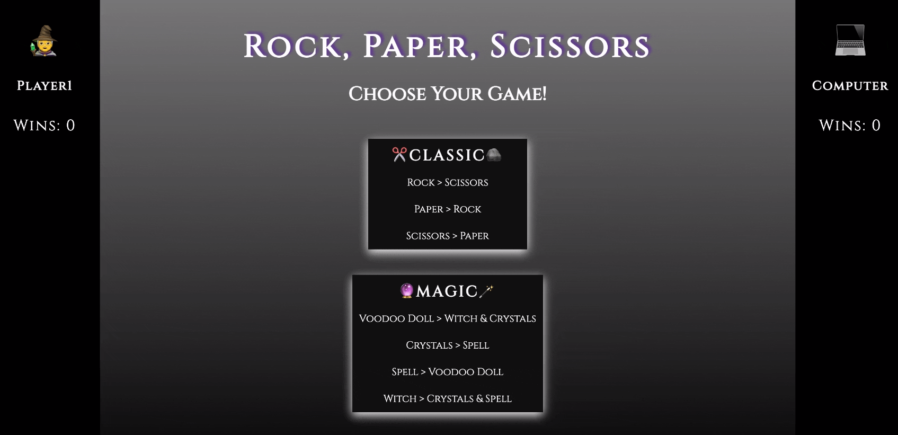
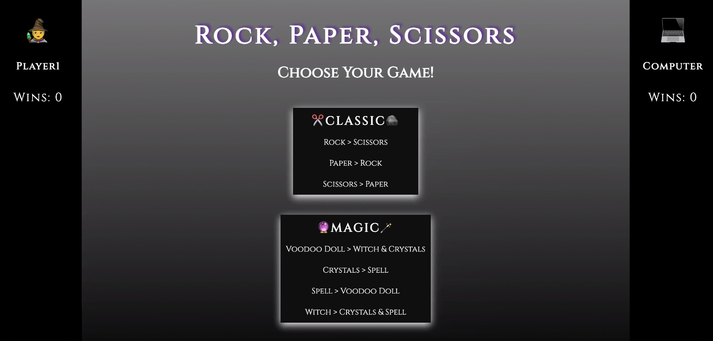
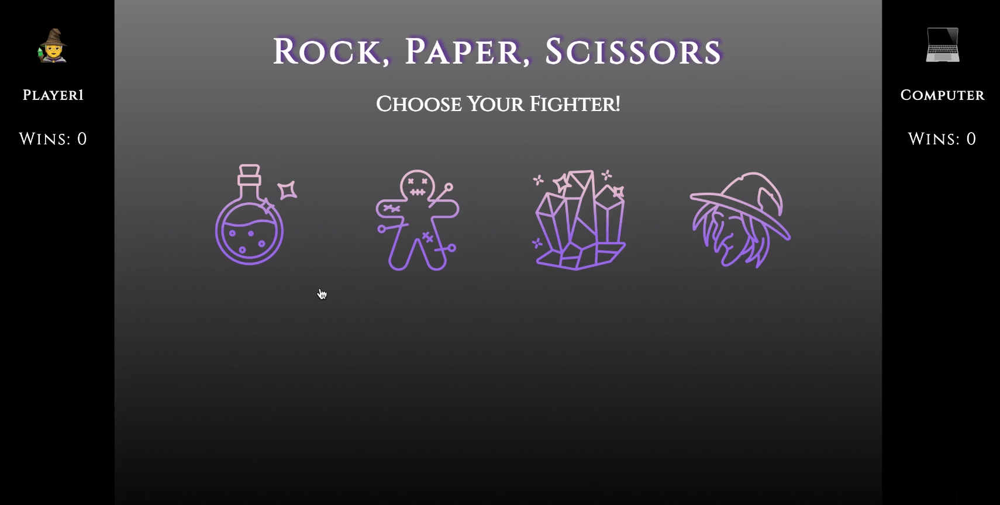
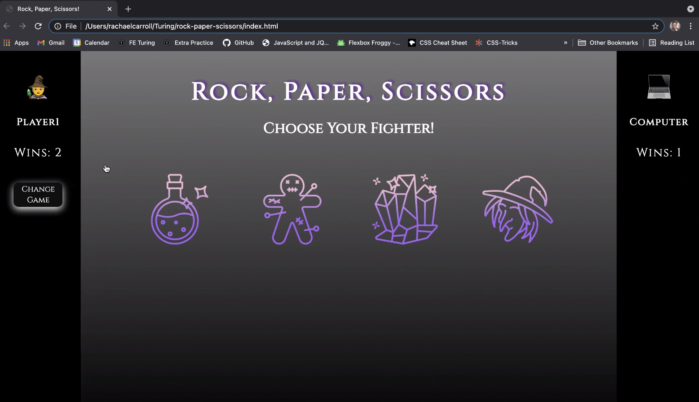

# Rock, Paper, Scissors

### Table of Contents
- [Overview](#overview-and-project-goals)
- [Features](#features)
- [Future Additions](#future-additions)
- [How To Contribute](#want-to-contribute)
- [Credits](#credits)

## Overview and Project Goals
The goal of [final solo project](https://frontend.turing.edu/projects/module-1/rock-paper-scissors-solo.html) for Mod1 at [Turing School of Software and Design](https://turing.io/) was to build a Rock, Paper, Scissors game from scratch using HTML, CSS, and Vanilla Javascript.

### Why was this project created?
To solidify and demonstrate the understanding of:

1. Writing clean and DRY HTML, CSS, and JavaScript
2. Understand the difference between the data model and how the data is displayed on the DOM
3. The interaction between multiple class files
4. Implementation of client-side data persistence by utilizing JSON and localStorage

## Features

- When the game loads, the user will see a left section displaying their emoji and wins and a right section displaying the computer emoji and wins. The main section directs the user to **Choose Your Game** and displays a Classic version and a *Magic* version.

- Based on the user's game choice, 3 or 4 icons will appear on the screen. Rock, Paper, Scissors for Classic.  Spell, Voodoo Doll, Crystals, Witch for Magic.

- The user may hover over their selection and click to choose their fighter. The computer will then make it's choice and both fighters will be displayed.  The game will result in either a player1 win, computer win, or draw. The respective wins will be displayed on the right and left sections.

- User has the option to change the game version at any time and their wins will not reset.  They may also leave the page and return to see that their wins are still displayed... a never-ending game of Rock, Paper, Scissors!

## Future Additions
- *New game* functionality to reset the wins and start a new game.
- *Choose your emoji* functionality to toggle through Player1 emojis.
- *Light & dark mode* to alter the game board based on the user's Classic or Magic game choice.

**[Back to top](#table-of-contents)**

## Instructions for Running Project
View the deployed page [here]() **OR**
1. Clone this [repository](https://github.com/rachaelcarroll/rock-paper-scissors)
2. `cd` into the repository in your terminal.
3. `open index.html` in your terminal to view it on your browser.

## Want to contribute?
If you would like to contribute, please fork this repository and clone it down to your local machine. Once you've successfully implemented the changes in code necessary for your intended contribution without changing any of the current functionality of main, submit a pull request for author to review the changes.

## Technologies Used

  
  
  
  

## Credits
#### Author
- The HTML, CSS, and Javascript for Rock, Paper, Scissors was written by [Rachael Carroll](https://github.com/rachaelcarroll), for her final solo project of Mod1.

#### Project Manager
- [Heather Faerber](https://github.com/hfaerber), a Mod1 frontend instructor.
**************************************************************************
Created for [Turing School of Software & Design](https://turing.io/).

**[Back to top](#table-of-contents)**
